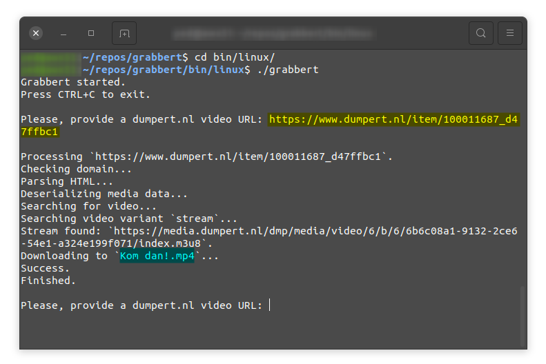

# Grabbert

A basic video downloader written in Rust.

Its purpose is currently only to download videos from https://dumpert.nl.



## Pre-requisites
- ffmpeg
- Linux/WSL (or build it yourself for Windows and macOS)

## Usage
```bash
$ cd bin/linux
$ ./grabbert
```

Example input: https://www.dumpert.nl/item/100011687_d47ffbc1
